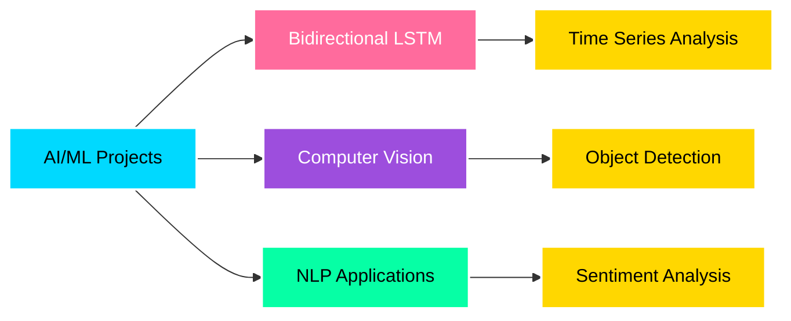

<h1 align="center">
  
</h1>

<div align="center">
  
</div>

<br>

<p align="center">
  
  
  
  
</p>

---

## 🚀 About Me


```python
class AIEngineer:
    def __init__(self):
        self.name = "Prabhakaran R"
        self.role = "AI/ML Engineering Student"
        self.college = "MCET"
        self.specialization = "CSE (AI/ML)"
        self.current_focus = [
            "Bidirectional LSTM Models",
            "Neural Computing",
            "Computer Vision",
            "NLP Applications"
        ]
        self.interests = [
            "Deep Learning",
            "Predictive Modeling",
            "Real-world AI Solutions"
        ]
    
    def say_hi(self):
        print("Let's innovate together!")

me = AIEngineer()
me.say_hi()
```

<br clear="right"/>

---

## 🌐 Let's Connect

<div align="center">
  
[](mailto:727623bam008@mcet.in)
[](https://www.linkedin.com/in/prabhakaran-r18)
[](https://github.com/Prabhakaran-R18)
[](https://leetcode.com/u/Prabha_1812/)

<br>


</div>

---

## 🛠️ Tech Arsenal

<div align="center">

### 💻 Programming Languages


### 🤖 AI/ML & Data Science


### 🗄️ Databases & Tools


</div>

---

## 📊 GitHub Statistics

<div align="center">
  
  
</div>

<br>

<div align="center">
  
  
</div>

---

## 🏆 Achievements

<div align="center">
  
</div>

---

## 🚀 Featured Projects

<div align="center">
  
| 🔥 Project | 📝 Description | 💻 Tech Stack |
|:-----------|:---------------|:--------------|
| [🚫 Spam Mail Detection](https://github.com/Prabhakaran-R18/spam-mail-detection) | ML model to detect spam emails with high accuracy | Python, NLP, scikit-learn |
| [🏥 Medical Diagnoser](https://github.com/Prabhakaran-R18/medical-diagnoser) | AI-powered medical diagnosis assistant | Python, TensorFlow, Keras |

</div>

<div align="center">
  <a href="https://github.com/Prabhakaran-R18?tab=repositories">
    
  </a>
</div>

---

## 🎓 Certifications & Credentials

<div align="center">
  <table>
    <tr>
      <td align="center" width="33%">
        <br>
        <sub><b>IBM AI Fundamentals</b></sub>
      </td>
      <td align="center" width="33%">
        <br>
        <sub><b>Complete Java Course</b></sub>
      </td>
      <td align="center" width="33%">
        <br>
        <sub><b>Introduction to IoT</b></sub>
      </td>
    </tr>
    <tr>
      <td align="center" width="33%">
        <br>
        <sub><b>ML Fundamentals</b></sub>
      </td>
      <td align="center" width="33%">
        <br>
        <sub><b>Python Programming</b></sub>
      </td>
      <td align="center" width="33%">
        <br>
        <sub><b>C Programming</b></sub>
      </td>
    </tr>
  </table>
</div>

---

## 📈 Contribution Activity

<div align="center">
  
</div>

---

## 🎯 Current Focus

<div align="center">



</div>

---

## 🎨 Beyond Coding

<div align="center">
  
| 📸 Photography | 🎨 Drawing | 🧶 Crafting |
|:--------------:|:----------:|:-----------:|
| Capturing moments | Artistic expression | Creative projects |

| 🤾‍♂️ Handball | 🎮 Carrom | 📚 Reading |
|:-------------:|:----------:|:----------:|
| Team sports | Strategic games | Knowledge building |

</div>

---

## 💡 Random Dev Quote

<div align="center">
  
</div>

---

## 🐍 Contribution Snake

<div align="center">
  
</div>

---

<div align="center">
  
</div>

<div align="center">
  
</div>

---

<div align="center">
  <sub>⭐ From <a href="https://github.com/prabhakaran-r">Prabhakaran R</a> with 💙</sub>
</div>
